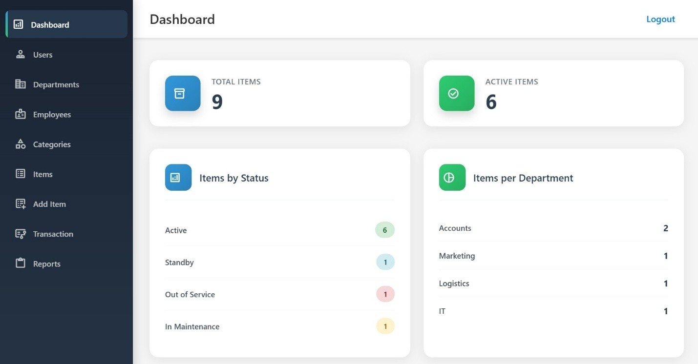
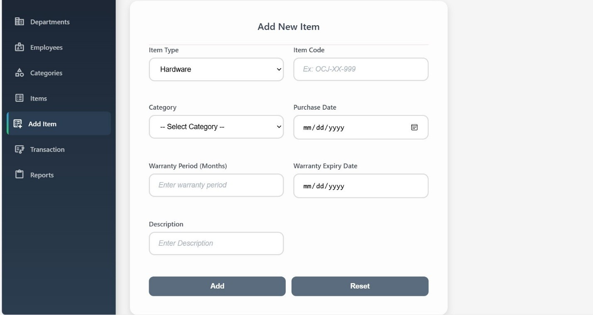
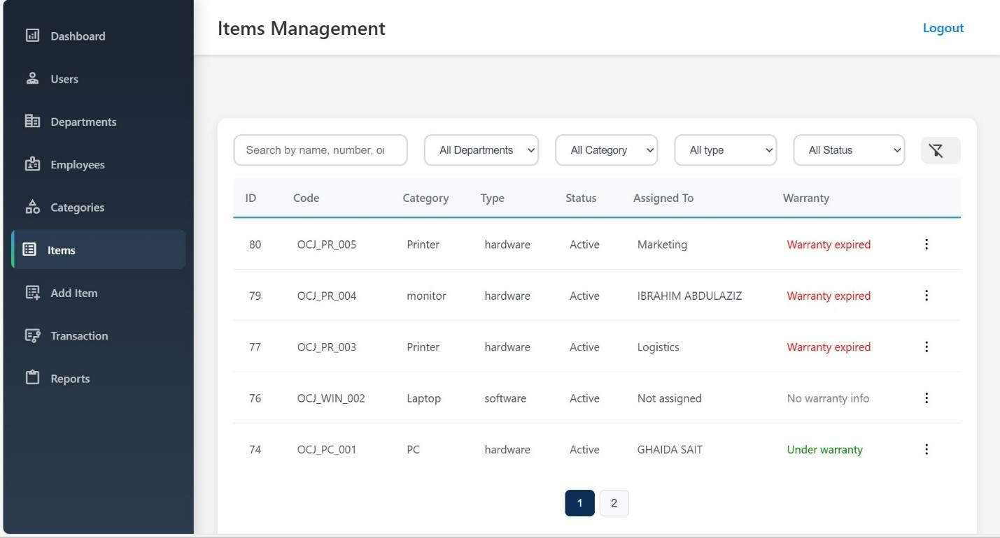
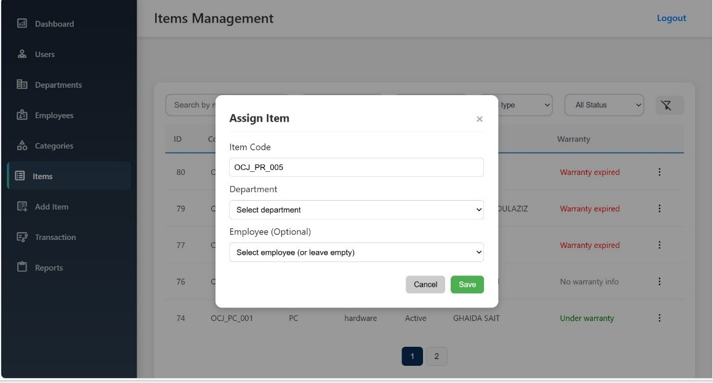
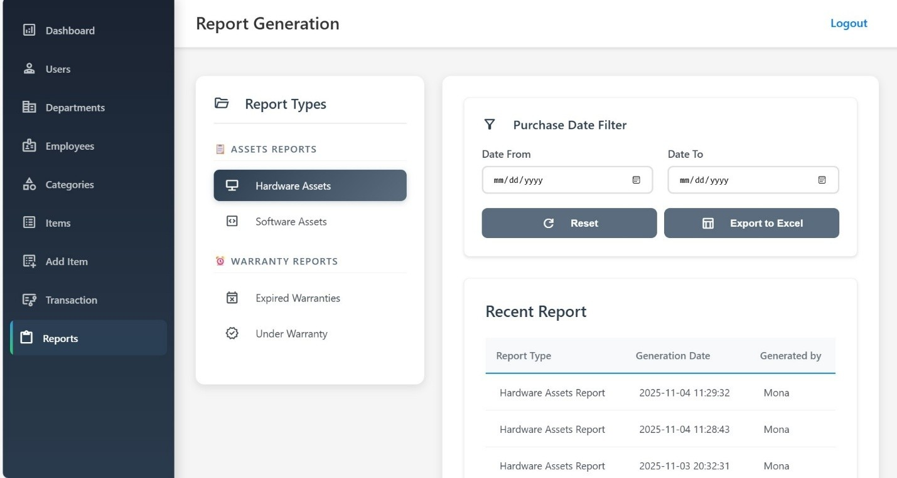

# Inventory Manager System

A robust, web-based resource management platform developed during my **IT Co-op training**. This system was designed to transition manual asset tracking into a streamlined, automated digital workflow, supporting everything from equipment assignment to real-time status reporting.

### \+ Technologies

**Frontend:**   

**Backend:**  

**Database:** 

### Features

  * **Full Asset Lifecycle:** Track items from procurement to retirement with specialized logic for transfers and returns.
  * **Role-Based Access:** Secure authentication for Admins and Users, ensuring sensitive data is only accessible to authorized personnel.
  * **Dynamic Reporting:** Real-time generation of inventory history and departmental assignment reports.
  * **Smart Modals:** A custom-built JavaScript "Modal Builder" that dynamically constructs UI elements for a smoother UX.

### The Process

During my internship, I saw how easily assets can get lost in spreadsheets. I wanted to build a "single source of truth."

The most interesting part of this project was designing the **Database Architecture**. I had to ensure that when an item moves from one department to another, its history remains intact. I spent a lot of time on the `item/` API logic, handling edge cases like "what happens if an employee leaves but still has an item assigned?"

Moving from pure theory to building a system that actually handles company resources was a huge milestone for me. It taught me the importance of writing clean, modular PHP code and keeping my SQL queries optimized.

### System Architecture

The project follows a modular structure to keep the business logic separated from the UI:

  * `/api`: Handles all CRUD operations and business logic.
  * `/assets`: Contains modular CSS and dynamic JS modal builders.
  * `/config`: Secure database connections and session management.

### Running the Project

1.  **Local Server:** Use XAMPP or WAMP to host the project via Apache.
2.  **Database:** Import the provided `.sql` schema into your MySQL instance.
3.  **Configuration:** Update `config/db.php` with your local credentials.
4.  **Access:** Navigate to `http://localhost/inventory-manager` in your browser.

-----

### 📸 System Screenshots

  
Click to view system interface

  
  

    
    
     
    
    
     
    
  

